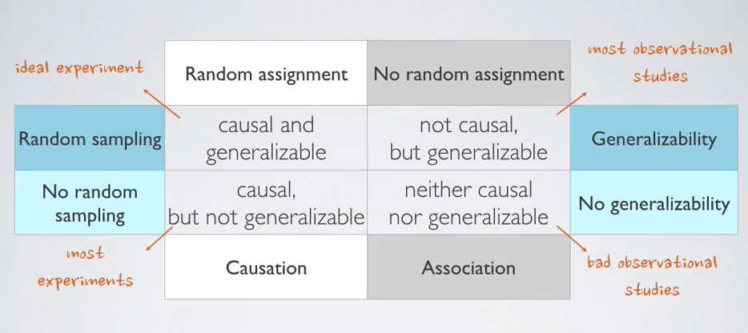

# Experimental Design

## Principles of Experimental Design

1. Control
    Compare treatment of interest to a control group
2. Randomize
    Randomly assign subjects to a treatment
3. Replicate
    Collect a suffiently representative sample in a study or replicate the entire study
4. Block
    Cancelling variables known or suspected to affect the study's outcome

## Blocking

Blocking is extremely important so that you can isolate a certain explanatory variable.

If you are designing an experiment to check if a certain substance such as creatine monohydrate affects the physical performance of individuals that lift weights you might notice that Creatine might affect people differently depending on which meal they consume it, whether they also use stimulants such as caffeine of if they drink enough water.

Due to that you might want to separate individuals into the treatment and control groups so that these specific variables are equally represented in both groups.

## Blocking Versus Explanatory Variables

Explanatory variables (factors) are the condictions we can subject our experimental units to, whilst blocking variables are characteristics inherent to the experimental units that we need to control.

Just like stratifying, when blocking you are essentially dividing the subjects into homogeneous groups. The only difference is that in this case you are assigning subjects randomly instead of sampling them randomly.

## Sampling and Assigning

It's important here to highlight the difference between sampling and assigning.

When doing **random sampling**, for example, we **pick individuals randomly** and with a **sufficiently representative sample** we can **generalize results** to an entire population.

**Random assignment**, which **can only occur in experimental settings**, **consists in assigning individuals to treatment and control groups** and might include **blocking certain variables that might affect the study's outcome**, making sure that these variables are equally represented in both groups. **Random assignment allows us to establish a relation of causality** between explanatory and result variables.

**A single study can apply both random sampling and random assignment** to ensure that the results it will obtain will be generalizable and that it will be possible to establish a relation of causality between explanatory and response variables.

## Experimental Terminology

* Placebo
    Placebo is the name given to a fake treatment often used as the control group for medical studies. When subjects show changes despite being on placebo we call that the "Placebo Effect"
* Blinding
    Blinding is when the subjects do not know whether they are in the control or treatment groups.
* Double-blinding
    Double-blinding is when both the subjects and the researchers don't know the group assignment.
